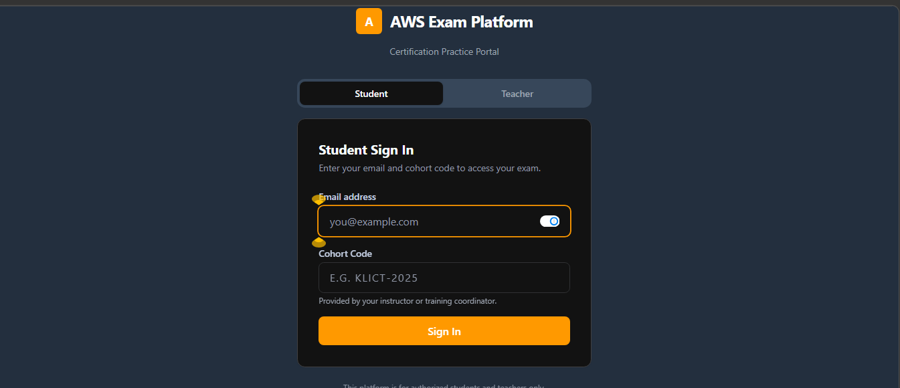
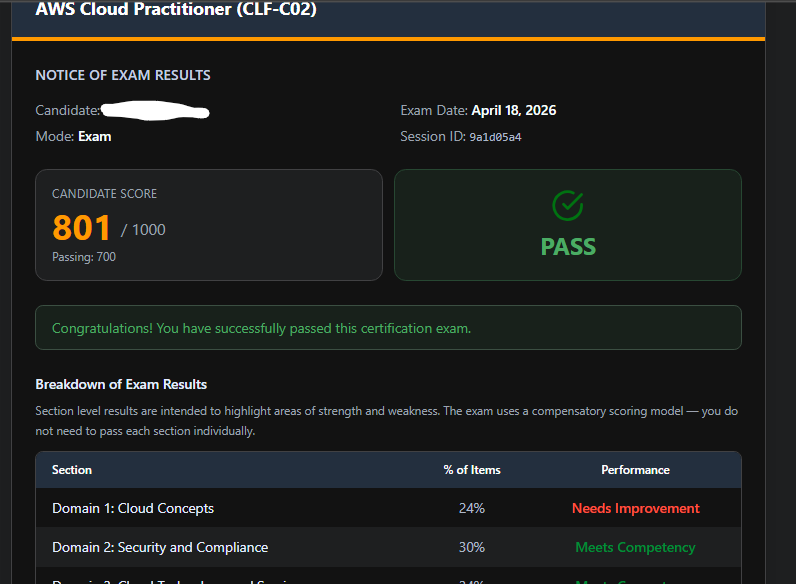
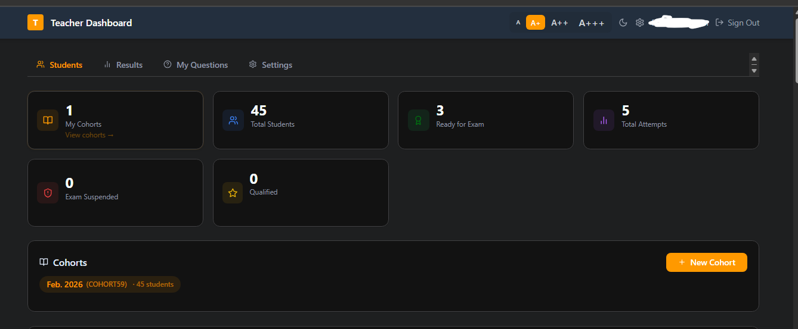
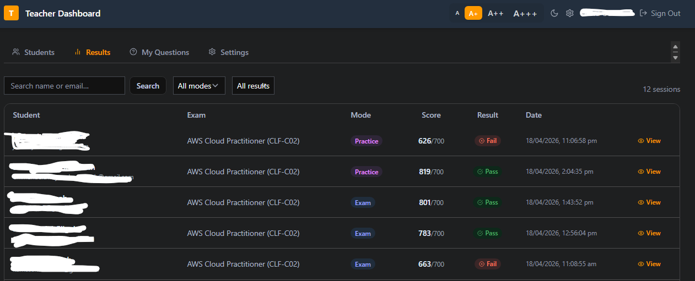

# CertPath

> An open-source AWS certification exam preparation platform built for training organisations, bootcamps, and self-learners.

[](LICENSE)
[](CHANGELOG.md)
[](CONTRIBUTING.md)
[](https://nodejs.org)
[](https://www.postgresql.org)
[](https://www.docker.com)
[](https://github.com/davidodediran/certpath/issues)

CertPath lets students practice and sit timed mock exams for AWS certifications (Cloud Practitioner, Solutions Architect, and more). Teachers manage cohorts and upload questions; admins oversee the platform; a superuser manages everything at the top level.

---

## Screenshots

<table>
  <tr>
    <td align="center"><strong>Student Login</strong></td>
    <td align="center"><strong>Exam Result</strong></td>
  </tr>
  <tr>
    <td></td>
    <td></td>
  </tr>
  <tr>
    <td align="center"><strong>Teacher Dashboard — Students</strong></td>
    <td align="center"><strong>Teacher Dashboard — Results</strong></td>
  </tr>
  <tr>
    <td></td>
    <td></td>
  </tr>
</table>

---

## Features

- **Exam mode** — timed, scored, AWS-style mock exams with 15 unscored research questions per session
- **Practice mode** — instant feedback, explanations, and reference links after each answer
- **Multi-select questions** — checkbox UI auto-detected from question text (`Choose two.`, `Select three.`, etc.)
- **Role system** — Student · Teacher · Admin · Superuser, each with their own dashboard
- **Question bank** — bulk CSV/PDF/DOCX upload, per-exam-type filtering, CSV export
- **Qualification tracking** — dual-path progress (>10 passes ≥750 OR >8 passes ≥800)
- **MFA** — TOTP two-factor authentication for students, teachers, and superusers
- **Review mode** — post-exam walkthrough with correct answers, explanations, and unscored question badges
- **Dark mode** — full light/dark theme support

---

## Tech Stack

| Layer | Technology |
|---|---|
| Frontend | React 18, Vite, Tailwind CSS |
| Backend | Node.js, Express |
| Database | PostgreSQL (via Knex.js) |
| Auth | JWT + bcrypt + TOTP (otplib) |
| Deployment | Docker, AWS EC2 |
| DB hosting | Supabase (or any PostgreSQL) |

---

## Quick Start (Local)

No accounts to create. No external database needed. Just Docker.

### Prerequisites

- [Docker](https://docs.docker.com/get-docker/) and Docker Compose
- Git

### 1. Clone the repo

```bash
git clone https://github.com/davidodediran/certpath.git
cd certpath
```

### 2. Start the app

```bash
docker compose up --build
```

This starts the frontend, backend, and a local PostgreSQL database automatically.

### 3. Run migrations (first run only)

```bash
docker compose exec backend node src/db/migrate.js
```

This creates all tables and seeds the default dev accounts.

### 4. Open the app

Visit **http://localhost** in your browser.

### Default login credentials (local dev only)

| Role | Login path | Email | Password |
|---|---|---|---|
| Admin | `/admin/login` | `admin@localhost.dev` | `admin1234` |
| Superuser | `/superuser/login` | `super@localhost.dev` | `super1234` |
| Student | `/login` | _(register via cohort code)_ | — |

> These credentials are development defaults only. Never use them in production.

---

## Environment Variables

The `docker-compose.yml` already has all variables pre-filled for local development — **no `.env` file needed to get started**.

If you are running the backend outside of Docker (e.g. native Node.js or EC2), copy the example file and fill in your values:

```bash
cp backend/.env.example backend/.env
```

| Variable | Description |
|---|---|
| `DATABASE_URL` | PostgreSQL connection string |
| `JWT_SECRET` | Random string min 32 chars — `node -e "console.log(require('crypto').randomBytes(48).toString('hex'))"` |
| `ADMIN_EMAIL` | Admin account email (seeded on first migration) |
| `ADMIN_PASSWORD` | Admin account password |
| `SUPER_EMAIL` | Superuser account email (seeded on first migration) |
| `SUPER_PASSWORD` | Superuser account password |

> **Never commit your `.env` file.** It is already in `.gitignore`.

---

## Deployment (AWS EC2 + Supabase)

A fully automated UserData bootstrap script is included at [`scripts/ec2-setup.sh`](scripts/ec2-setup.sh).

### Steps

1. **Create a Supabase project** at [supabase.com](https://supabase.com) and note your database host and password.

2. **Fill in the credentials** at the top of `scripts/ec2-setup.sh`:

```bash
DB_HOST=""        # e.g. db.abcdefgh.supabase.co  (no https://)
DB_PASSWORD=""
JWT_SECRET=""     # node -e "console.log(require('crypto').randomBytes(48).toString('hex'))"
ADMIN_EMAIL=""
ADMIN_PASSWORD=""
SUPER_EMAIL=""
SUPER_PASSWORD=""
```

3. **Launch an EC2 instance** (Amazon Linux 2023, t3.micro or larger):
   - Paste the filled script into **Advanced → User data**
   - Open ports **80** and **443** in the security group

4. The script automatically installs Docker, clones the repo, writes the `.env`, builds the image, and runs migrations.

5. Visit `http://<your-ec2-public-ip>` once the instance is ready (~10 minutes).

**SSH access** (no key pair needed): AWS Console → EC2 → Connect → EC2 Instance Connect

---

## User Roles

| Role | Login path | Responsibilities |
|---|---|---|
| Student | `/login` | Take exams and practice sessions |
| Teacher | `/teacher/login` | Manage cohorts, upload questions |
| Admin | `/admin/login` | Oversee question bank, manage teachers |
| Superuser | `/superuser/login` | Manage admins, platform-wide stats, MFA |

---

## Project Structure

```
certpath/
├── frontend/                   # React + Vite app
│   └── src/
│       ├── pages/              # Route-level components
│       ├── components/
│       └── lib/                # API client, utilities
├── backend/                    # Express API
│   └── src/
│       ├── routes/             # auth, exams, teacher, admin, superuser…
│       ├── db/                 # Knex connection + migrations
│       └── middleware/
├── docs/
│   └── screenshots/            # App screenshots used in README
├── scripts/
│   └── ec2-setup.sh            # EC2 UserData bootstrap
├── Dockerfile
├── docker-compose.yml          # Local development
└── docker-compose.ec2.yml      # EC2 production (external DB)
```

---

## Contributing

Contributions are welcome and appreciated. Please read [CONTRIBUTING.md](CONTRIBUTING.md) before opening a pull request.

Quick summary:
1. Fork the repo
2. Create a feature branch: `git checkout -b feat/your-feature`
3. Commit your changes
4. Open a Pull Request against `main`

---

## Security

To report a vulnerability, please follow our [responsible disclosure policy](SECURITY.md). Do **not** open a public GitHub issue for security bugs.

---

## Code of Conduct

This project follows the [Contributor Covenant Code of Conduct](CODE_OF_CONDUCT.md). By participating you agree to uphold it.

---

## Changelog

See [CHANGELOG.md](CHANGELOG.md) for a full history of releases.

---

## License

[MIT](LICENSE) — free to use, modify, and distribute.
